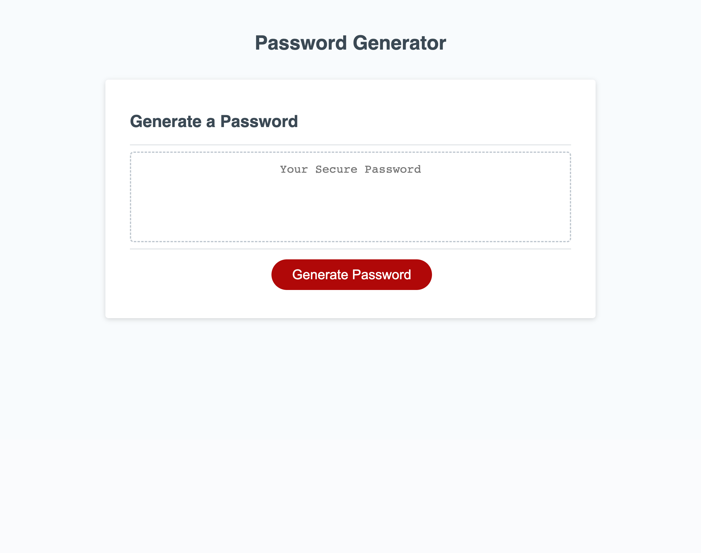

# password-wizard
A random password generator.

## Description

This password generator was created to assist anyone with generating a secure password between 8-128 characters that includes lowercase, uppercase, numeric, and/or special characters. 

## Installation

N/A

## Usage

To initialize the process of generating a password select the red 'Generate Password' button. The password generator will present a series of prompts for password criteria. The first prompt will ask about the length of the password. Type in a positive integer and select 'Ok' or press 'Enter' on your keyboard to continue. For the remaining criteria select the 'Ok' button or press 'Enter' on the keyboard to add specific characteristics in your password or select 'Cancel' to omit them. Once you have answered all of the questions, a password will be generated and appear in the 'Generate a Password' text box.

To access the Github Repository visit:
https://github.com/CarolinaRaIs/password-wizard

To access the deployed site visit:
https://carolinarais.github.io/password-wizard/ 

## Credits

N/A

## License

Please refer to the LICENSE in the repo (MIT License).